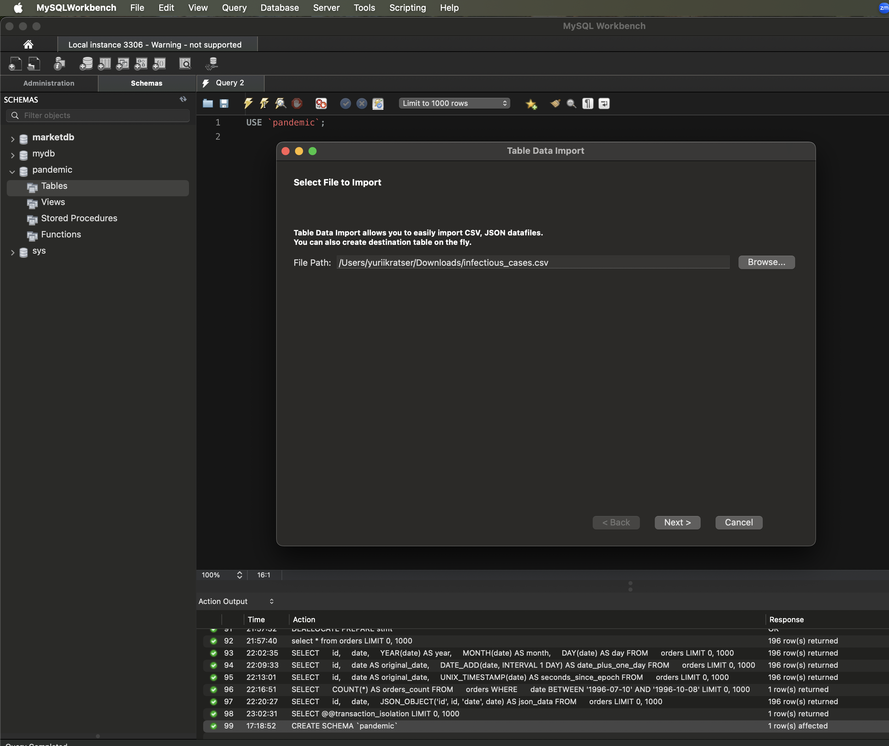
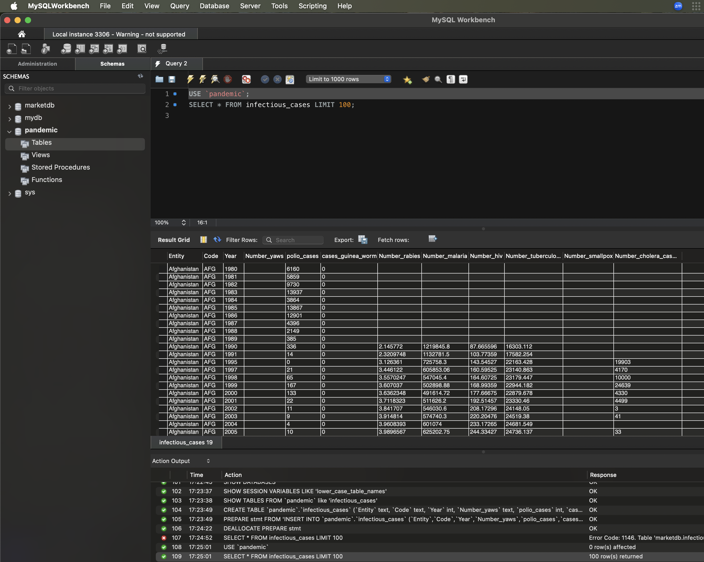
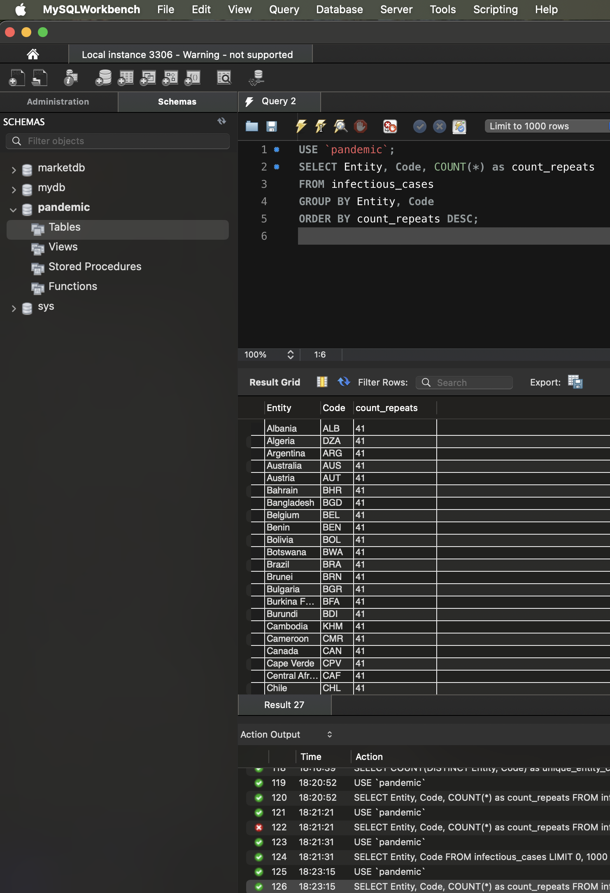
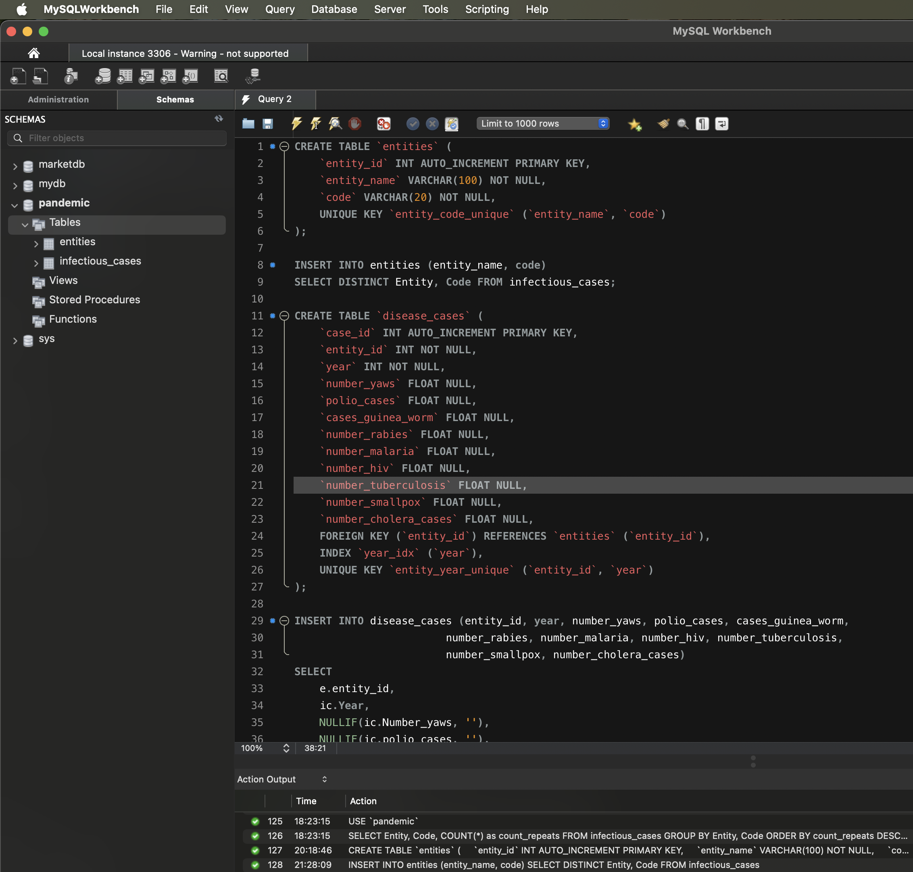
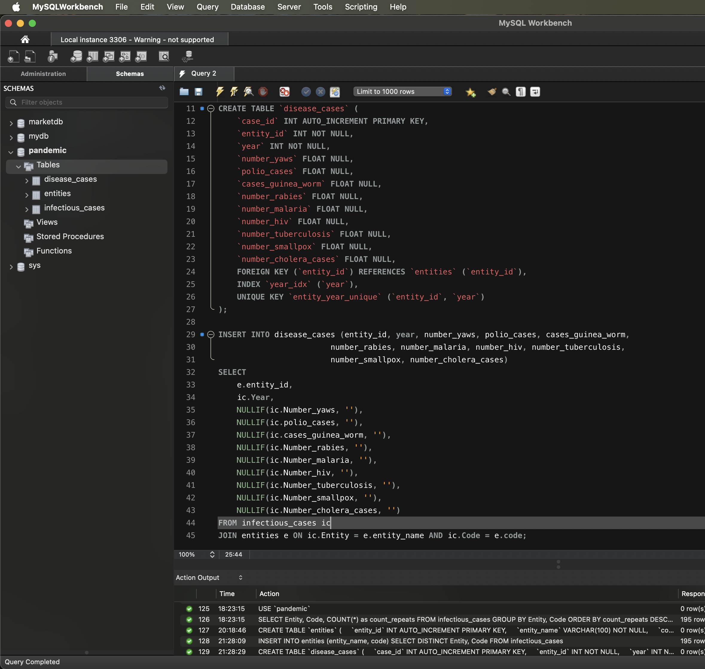
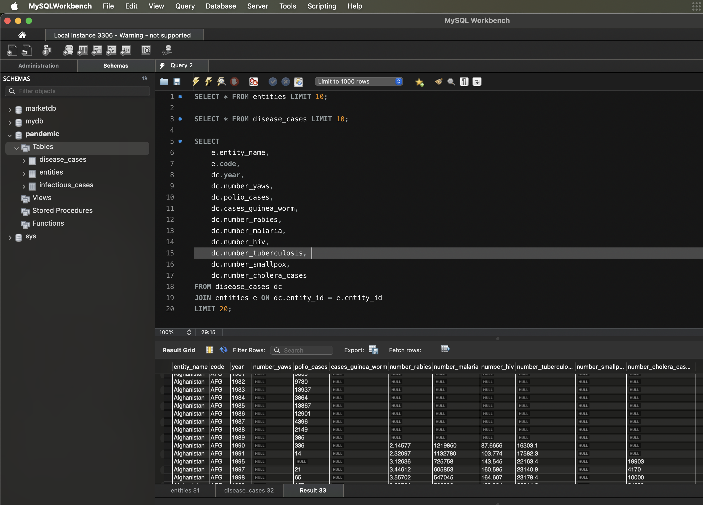

# Завдання 1

## Опис
- Створіть схему pandemic у базі даних за допомогою SQL-команди.
- Оберіть її як схему за замовчуванням за допомогою SQL-команди.
- Імпортуйте дані за допомогою Import wizard так, як ви вже робили це у темі 3.
  
- Продивіться дані, щоб бути у контексті.
  
- Виявлення дублювання
  

  ### Проведення нормалізації
- `Перша нормальна форма (1НФ)`: Дані вже є атомарними, тож вони відповідають 1НФ.
- `Друга нормальна форма (2НФ)`: Ми виділили окрему таблицю для Entity і Code, оскільки інші атрибути (дані по захворюваннях) залежать не тільки від них, 
   але й від року.
-  `Третя нормальна форма (3НФ)`: Тепер дані в таблиці disease_cases залежать тільки від первинного ключа (entity_id і year), а не від інших неключових атрибутів.
 
 

Запит щоб подивитись результат

## SQL-запит
```sql
SELECT * FROM entities LIMIT 10;

SELECT * FROM disease_cases LIMIT 10;

SELECT 
    e.entity_name, 
    e.code, 
    dc.year, 
    dc.number_yaws, 
    dc.polio_cases, 
    dc.cases_guinea_worm, 
    dc.number_rabies, 
    dc.number_malaria, 
    dc.number_hiv, 
    dc.number_tuberculosis, 
    dc.number_smallpox, 
    dc.number_cholera_cases
FROM disease_cases dc
JOIN entities e ON dc.entity_id = e.entity_id
LIMIT 20;
```


