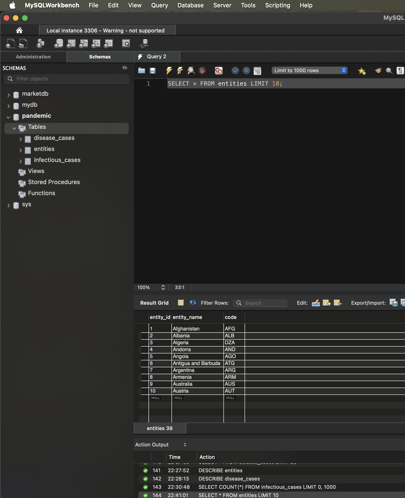
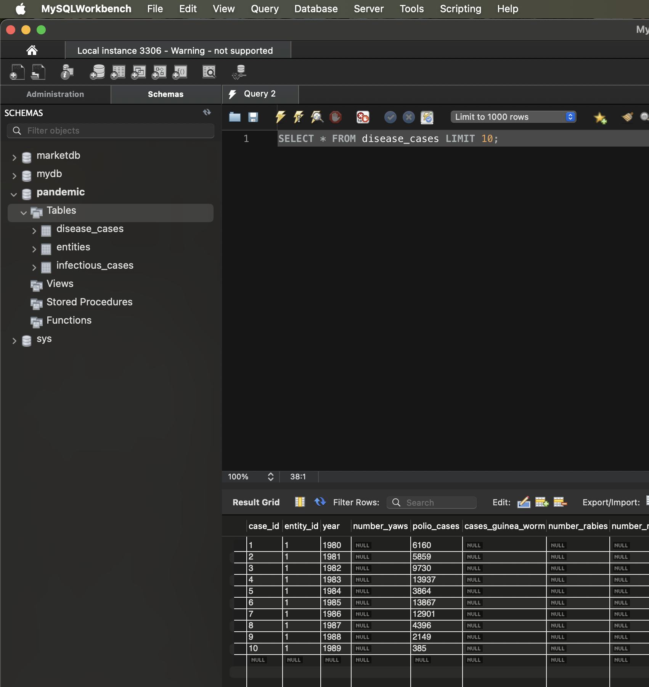

# Нормалізація даних до 3НФ

## Завдання 2
В рамках другого завдання була виконана нормалізація таблиці `infectious_cases` до 3НФ шляхом створення двох нормалізованих таблиць.

### Таблиця `entities`
Містить унікальні комбінації Entity та Code, які були виділені з вихідної таблиці для усунення повторень. Таблиця має первинний ключ `entity_id` та унікальне обмеження на комбінацію `entity_name` та `code`.
  

### Таблиця `disease_cases`
Містить дані про випадки захворювань з посиланням на таблицю `entities` через зовнішній ключ `entity_id`. Кожен запис містить рік та статистичні дані по різних захворюваннях.
  

### Результат запиту
Запит `SELECT COUNT(*) FROM infectious_cases` показав, що вихідна таблиця містить **7271** записів, які були успішно нормалізовані та розподілені між двома створеними таблицями.
  