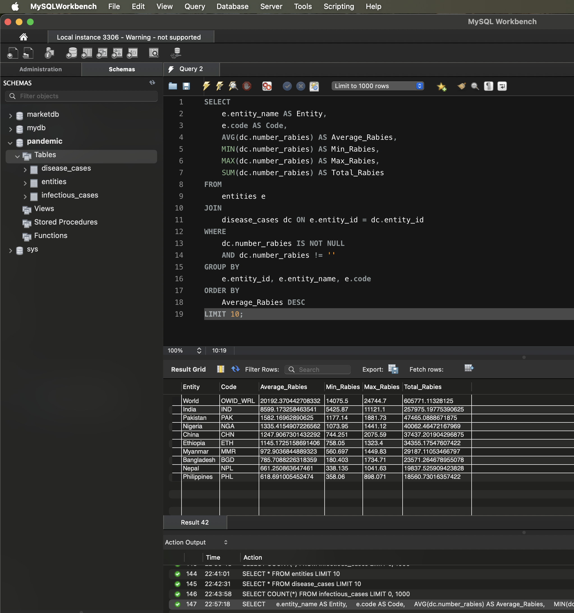

# Аналіз даних про випадки сказу

## Завдання 3
У рамках третього завдання було проведено аналіз даних для атрибута `Number_rabies` (кількість випадків сказу) відповідно до наступних вимог:

### Використаний SQL-запит
Для аналізу був виконаний запит, який дозволив визначити статистичні показники випадків сказу для кожної країни:

```sql
SELECT 
   e.entity_name AS Entity,
   e.code AS Code,
   AVG(dc.number_rabies) AS Average_Rabies,
   MIN(dc.number_rabies) AS Min_Rabies,
   MAX(dc.number_rabies) AS Max_Rabies,
   SUM(dc.number_rabies) AS Total_Rabies
FROM 
   entities e
JOIN 
   disease_cases dc ON e.entity_id = dc.entity_id
WHERE 
   dc.number_rabies IS NOT NULL
   AND dc.number_rabies != ''
GROUP BY 
   e.entity_id, e.entity_name, e.code
ORDER BY 
   Average_Rabies DESC
LIMIT 10;
```
