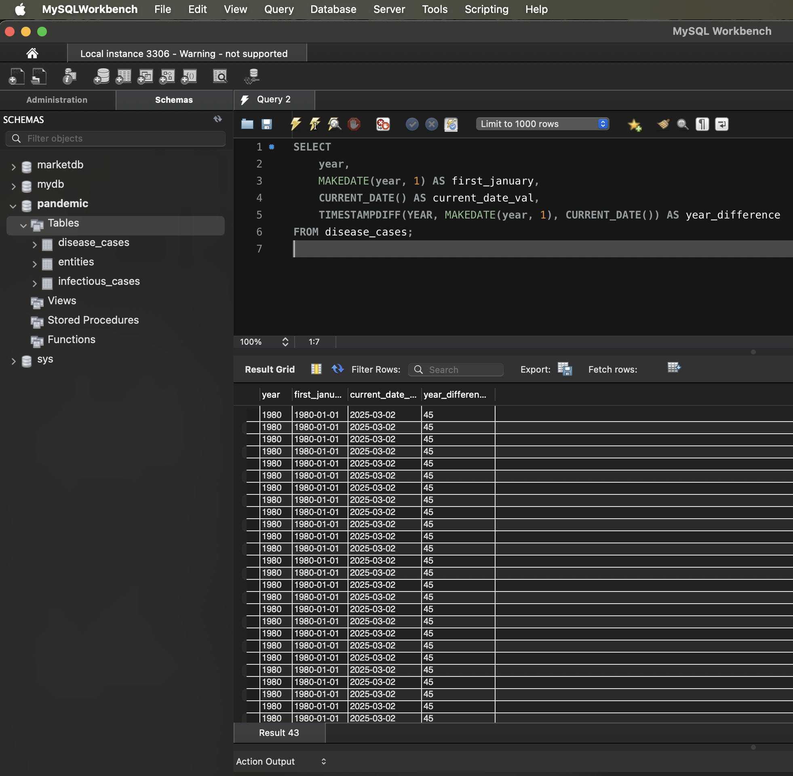

# Обробка часових даних в SQL

## Завдання 4
У рамках четвертого завдання було виконано аналіз часових даних з використанням вбудованих SQL-функцій для обробки дат і часу.

### Використаний SQL-запит
Для обробки часових даних реалізовано наступний запит:

```sql
SELECT
   year,
   MAKEDATE(year, 1) AS first_january,
   CURRENT_DATE() AS current_date_val,
   TIMESTAMPDIFF(YEAR, MAKEDATE(year, 1), CURRENT_DATE()) AS year_difference
FROM disease_cases;
```
