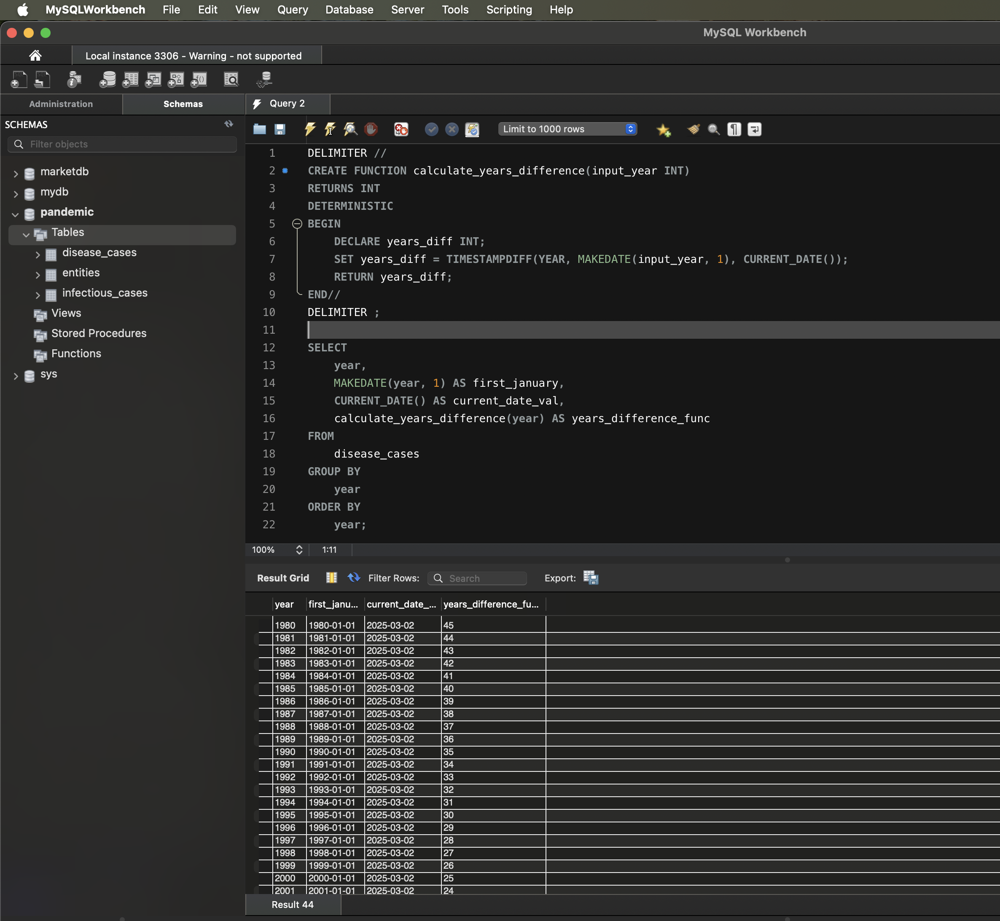

# Створення та використання користувацької функції

## Завдання 5
У цьому завданні створено власну функцію для роботи з часовими даними, яка обчислює різницю в роках між поточною датою та датою, створеною з атрибута року.

### Створення функції
```sql
DELIMITER //
CREATE FUNCTION calculate_years_difference(input_year INT) 
RETURNS INT
DETERMINISTIC
BEGIN
   DECLARE years_diff INT;
   SET years_diff = TIMESTAMPDIFF(YEAR, MAKEDATE(input_year, 1), CURRENT_DATE());
   RETURN years_diff;
END//
DELIMITER ;
```
